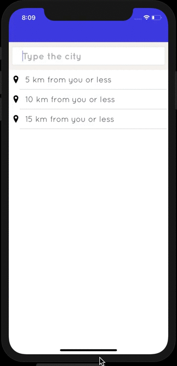

# Location filter

Custom react-native component for searching places by their names with [GeoNames](https://www.geonames.org).

## How it works



## How to run

```
git clone SSH/https link
yarn install
yarn pod:install
react-native run-ios or run-android
```

## Technology stack

| For                  | Link                                                                                                                                    |
| :------------------- | :-------------------------------------------------------------------------------------------------------------------------------------- |
| API                  | [GeoNames](https://www.geonames.org)                                                                                                    |
| React                | [React](https://reactjs.org/)                                                                                                           |
| React Native         | [React Native](https://facebook.github.io/react-native/)                                                                                |
| Language             | [Typescript](https://www.typescriptlang.org/)                                                                                           |
| Navigation           | [react-native-navigation](https://github.com/wix/react-native-navigation)                                                               |
| Network              | [axios](https://github.com/axios/axios)                                                                                                 |
| Internationalization | [react-native-localize](https://github.com/react-native-community/react-native-localize) + [i18n-js](https://github.com/fnando/i18n-js) |
| Image                | [react-native-fast-image](https://github.com/DylanVann/react-native-fast-image)                                                         |
